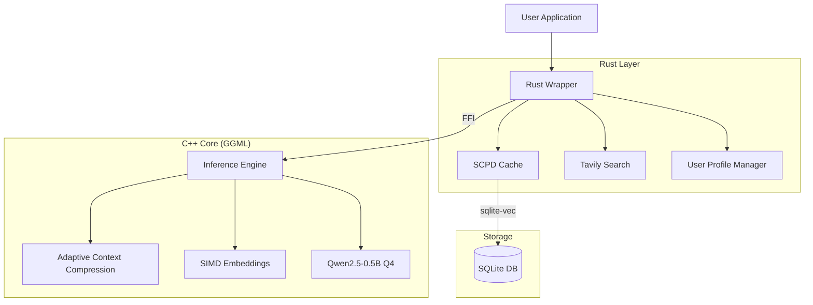

# System Architecture

AdaptiveSLM uses a hybrid architecture combining high-performance C++ inference with a safe, concurrent Rust wrapper.

## 1. C++ Core (`core/`)

The core is built on top of **GGML** (the tensor library behind llama.cpp) for maximum performance on CPU.

### Key Components:
- **Inference Engine**: Handles model loading and token generation using 4-bit quantized Qwen2.5-0.5B.
- **ACC Module (`context_adapt.cpp`)**: Monitors `/proc/meminfo` and battery state to adjust `n_ctx` (context size) dynamically.
- **SIMD Embeddings (`embeddings.cpp`)**: Uses AVX2/NEON intrinsics for fast cosine similarity calculations used in RAG.

## 2. Rust Wrapper (`rust-wrapper/`)

Provides a safe, async API and manages high-level logic.

### Key Components:
- **SCPD Cache**: Intecepts prompts. If a semantic match is found in SQLite (via `sqlite-vec`), returns the cached response.
- **Tavily Search**: If cache miss, optionally fetches live data from the web to augment the prompt (RAG).
- **FFI**: Safe bindings to the C++ core.

## 3. Novel Research Contributions

### Profile-Aware Knowledge Distillation (PAKD)
Instead of generic distillation, we train multiple "expert heads" or bias the weights based on user profiles (e.g., Student, Developer, Creative). The loss function during training is:

$$ L = (1 - \alpha) L_{CE} + \alpha L_{KD} + \beta L_{Profile} $$

### Adaptive Context Compression (ACC)
Real-time context management. If system RAM is low (<10% free), ACC aggressively compresses the KV cache or reduces the context window used for the next generation.

### Semantic Cache with Priority Decay (SCPD)
Cache eviction is not just LRU. Each entry has a priority score $P(t)$:

$$ P(t) = \alpha \cdot \text{Recency} + \beta \cdot \text{SemanticRelevance} + \gamma \cdot \text{ProfileMatch} $$

Entries decay over time and are evicted when $P(t)$ drops below a threshold.
