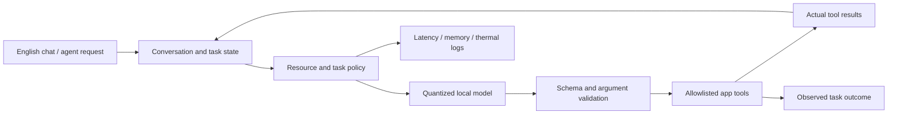

# AdaptiveSLM: project audit and implementation plan

**Audit date:** 2026-10-01. **Starting commit:** `2e1edaa4823578eddfda8c4ec8924ae76fcfde10`. Changes in this audit are local and uncommitted.

## Recommendation

Build an English Android assistant around a pretrained compact model, a measured phone runtime, and explicit app tools. Adapt it with LoRA on free Colab/Kaggle after establishing an unmodified baseline. Investigate lifecycle-aware recovery after process death or model unloading as the provisional research question; broad budget-aware recovery already has close prior art. See the [paper-direction proposal and prior-art matrix](research-direction.md). Keep the custom architecture, profile distillation and early exits as separate experiments until they demonstrate benefits against that baseline.

The existing repository is a useful experimental starting point, but it does not yet establish a capable trained student, a total app memory limit, sustained mobile speed, or an Android agent. New models and mobile runtimes improve the available starting points; they do not remove the need for task-specific evaluation.

Confirmed user requirements: English; free training sessions; portable checkpoints; memory budget chosen from measurements on the actual phone; chat plus agent mode; notes, task list and calculator in our demo app first, broader other-app control later; no fixed deadline. Publication venue and final tasks remain open. The phone is now authorized: Samsung Galaxy M35 5G (`SM-M356B`), Android 16/API 36, arm64, Exynos 1380 (`s5e8835`), eight logical CPUs. `/proc/meminfo` reported 5.30 GiB usable physical RAM and 1.98 GiB available at capture time. These kernel numbers differ from marketed RAM capacity. GPU/NPU inference support is still unverified. See [phone-profile.json](phone-profile.json). Samsung identifies the Exynos 1380 CPU/GPU as four Cortex-A78 plus four Cortex-A55 cores and Mali-G68; this favors a CPU-first prototype with a later measured GPU alternative. [Samsung Exynos specifications](https://semiconductor.samsung.com/processor/mobile-processor/exynos-1380/).

## Evidence and boundaries

The audit covered training scripts/notebooks, data preparation, C++ inference/context/embedding/profile code, Rust inference/cache/retrieval/wrapper code, benchmarks, build/CI and project documentation. Public model/dataset metadata was checked and saved in [source-availability.json](source-availability.json). Metadata accessibility alone does not prove that all files, schemas or licensing conditions are suitable.

Local numerical reproductions and fresh native builds were run. The baseline dataset/tokenizer preflight was exercised against a pinned live source. A real SmolLM2-360M model completed a small CPU LoRA training/evaluation run, checkpoint reload, merge, GGUF conversion and quantization. Tiny offline tests independently compared interrupted/resumed training against uninterrupted training. These are pipeline checks; they do not establish agent quality or cloud CUDA compatibility.

No prior cloud traceback was available. The likely memory/dependency causes below follow from code and reproductions, rather than proof that a particular Colab session failed for that reason. Phone hardware and a short native inference test were completed after USB authorization. Rust tests could not complete offline because a dependency was missing from the local registry.

## What needs correction in the original project

| Area | Finding and consequence | Disposition |
|---|---|---|
| Foundation training | The v2 default has 305,482,752 unique parameters, initialized randomly. Its 100,000-row, 512-token pretraining pass permits at most 51.2M raw tokens, before filtering/padding. This is insufficient evidence of competitive general language ability. | Use pretrained weights for the first implementation. Retain custom pretraining as a separate experiment. |
| Vocabulary and memory | 116,686,848 embedding parameters are about 38.2% of this student. A single FP16 logits tensor at batch 16 × 512 tokens × 151,936 vocabulary entries is 2.32 GiB. Three depth outputs total about 6.96 GiB before loss temporaries/backward, other activations or a teacher. FP32 student parameters, gradients and two Adam moments alone approach 4.55 GiB. | Do not assume that reducing model parameter count makes the old training loop fit a free GPU. The new starter uses a frozen pretrained base, short sequences and batch one. |
| Numerical stability | RMSNorm squared FP16 activations directly; input values of 300 reproduced overflow and zero outputs. | Fixed by computing variance in FP32; regression added. |
| Distillation loss | `batchmean` normalized KL by batch rather than valid target tokens. Masked/prompt positions contributed; sequence length changed scale. Altering only ignored teacher positions changed the old loss from about 3.83 to 25.00 in a controlled fixture. | Fixed target masking, token normalization and FP32 loss chunks. Large output tensors still exist; this does not certify legacy GPU memory use. |
| Supervision/template | Legacy labels include user/system tokens. Handwritten ChatML bypasses model-specific templates and thinking modes. | New baseline uses the tokenizer's canonical inference prefix and labels only the final assistant response. Full native tool-result supervision remains future work. |
| PAKD data | Persona assignment changes a system prompt while retaining the same Alpaca answer. Arbitrary weights do not demonstrate personalization. Reusing questions across phases can contaminate evaluation. | Require genuinely profile-specific targets, grouped splits and matched held-out tasks. Do not claim persona benefit yet. |
| Teacher reference | `Qwen/Qwen3-1.7B-Instruct-2507` failed public API access; the public `Qwen/Qwen3-1.7B` reference resolves. | Corrected Kaggle teacher reference. Other legacy datasets checked still expose metadata; not every old failure was a dead source. |
| Checkpoints | Legacy saves contain model/config only at phase end. No optimizer/scheduler/RNG state or mid-phase continuation. Missing phases can silently skip and export an untrained model. Gradient accumulation can discard a remainder. | New Trainer path saves resumable checkpoints and rejects incompatible manifests. Legacy lifecycle remains experimental. |
| Cloud setup | Floating packages, hidden shell failure statuses, uncontrolled repository pulls, unmatched converter versions and unsupported TPU/multi-GPU promises make runs hard to reproduce. | New uploadable starter, pinned revisions/dependencies, full failures, one-GPU path and isolated converter. GPU provider wheel retained and recorded. |
| Context adaptation | Updating a logical token limit does not resize the initially allocated llama.cpp context, compress existing KV state, or recover discarded history. EMA smoothing repeatedly quantized its own state and could remain stuck at 512 despite a 2048 target. | EMA accumulation and emergency behavior fixed and tested. Rename/describe current behavior as context budgeting; actual KV reduction is not implemented. |
| Memory claims | `llama_state_get_size` measures serialization, not allocated KV/working memory. Weight size plus state is not peak process memory. mmap does not guarantee a small working set. | Removed the benchmark's false memory-pass claim. Measure real RSS/PSS over the complete app workload. |
| Cache | Feature hashes are lexical, not learned semantic embeddings; Rust/C++ hashes differ. Keys omit model/profile/system/tool/state versions. Negations and numbers can produce unsafe approximate matches. Priority/decay routines do not establish the advertised runtime behavior. | Disable approximate answer reuse for the first agent. Introduce versioned exact caching, freshness rules and correctness tests before semantic reuse. Never replay a cached side effect. |
| Rust/FFI | Changing profile does not hot-switch inference depth. Static family selection conflates user expertise with task difficulty. Async generation blocks; cancellation and UTF-8 chunk assembly need work. Optional vector-cache and model-dependent tests need independent validation. | Keep the working C++ substrate but reassess whether the Android app needs the Rust layer. An extra FFI layer should earn its complexity. |
| Token output | A 128-byte token piece could be terminated one byte beyond the buffer. Oversized pieces and split UTF-8 still need robust handling. | Terminator capacity fixed. Full dynamic token-piece retry and incremental UTF-8 decoding remain open. |
| Agent/mobile app | No complete Android app, JNI lifecycle, durable conversation state, tool schema/parser/executor or bounded action loop is present. Clearing KV between calls is not conversation management. | Build these explicitly; a GGUF model alone cannot operate apps. |
| Evaluation | Comparison scripts use unsourced/hardware-mismatched baseline numbers, fastest individual results and inadequate memory accounting. MMLU has import/output/tokenizer/config issues and can omit failed subjects. | Replace with a controlled evaluation harness before reporting research results. |
| Build hygiene | Cached CMake references a missing external Ninja path. Thousands of Rust `target/` artifacts are tracked. CI did not execute C++ tests; Rust CI does not prepare its C++ dependency. | Fresh out-of-tree native build passed; C++ ctest added to CI. Remove tracked build output in a deliberate cleanup and repair Rust CI separately. |

### Measured memory example

The existing local file named `qwen2.5-0.5b-instruct-q4_k_m.gguf` reported 462.96 MiB model/state estimate and “under 512 MB,” but `/usr/bin/time -v` measured **606,876 KiB = 592.7 MiB peak RSS** during three short desktop generations. The runtime allocated 24 MiB KV and a 298.5 MiB compute buffer; reserved buffer size and resident pages are different quantities. The benchmark reported 31.9 tokens/s overall.

This is a desktop observation, not a phone result. Its GGUF metadata reports 630.17M stored parameters; the original Qwen configuration has tied embeddings. Check provenance and duplicated tensors before treating this particular artifact as an official baseline. [Official Qwen configuration](https://huggingface.co/Qwen/Qwen2.5-0.5B-Instruct/raw/main/config.json).

### Native phone smoke result

After authorization, the merged/quantized SmolLM2 pipeline-test artifact ran on the M35 CPU: three 64-token generations in about 12.73 seconds total process time; 15.9 generated tokens/s across timed generation calls including prompt processing; **394,796 KiB = 385.5 MiB peak process RSS**. Context allocation was 2048, with four inference threads. The phone was USB-powered; thermal status was 0 before/after. This short run is not a sustained thermal or energy measurement, and native-process RSS excludes an Android application's UI/services. Sampling was enabled, and the existing wrapper still supplied its hardcoded profile/ChatML prompt.

The 258.1 MiB GGUF file contains substantial fallback Q5 quantization because many tensor dimensions are incompatible with the requested K-block format. A Q4_K_M label does not imply four bits for every weight. The model received only a synthetic pipeline smoke update; these outputs are not evidence of a trained research agent. [Raw phone output](phone-native-smoke.txt), [validation record](audit-validation.json).

## Model candidates as of the audit date

Do not choose a winner from vendor speed tables: runtime, quantization, prompt length, thermals and device differ. First measure untouched models on identical tasks and the authorized phone.

| Candidate | Role in this project | Decision constraint |
|---|---|---|
| [LFM2.5-350M](https://huggingface.co/LiquidAI/LFM2.5-350M) | First modern compact agent candidate. Hybrid convolution/attention design; published support for structured outputs and tool use. | Requires modern runtime and its own template/tool protocol. Custom license. The authors caution against knowledge-heavy tasks and programming. Published phone speed/memory is not this phone's result. |
| [Qwen3-0.6B](https://huggingface.co/Qwen/Qwen3-0.6B) | Familiar transformer alternative with non-thinking chat mode. | Large vocabulary and reasoning-token costs matter. Explicitly select and test non-thinking mode. |
| [Qwen3.5-0.8B](https://huggingface.co/Qwen/Qwen3.5-0.8B) | Larger modern comparison if measured memory allows. | Hybrid/multimodal packaging adds export/backend requirements. Limit context deliberately; advertised maximum context is not a mobile default. |
| [FunctionGemma 270M](https://huggingface.co/google/functiongemma-270m-it) | Dedicated low-footprint tool specialist and an essential agent baseline. | Gated terms; different function-call template; requires task adaptation and is not intended as a direct general dialogue model. Use the [official mobile-action recipe](https://ai.google.dev/gemma/docs/mobile-actions) as prior art. |
| [Gemma 3 270M IT](https://huggingface.co/google/gemma-3-270m-it) | Small lower-capacity comparison. | Gated access and Gemma terms; correct model-specific prompt template. Small size does not establish agent ability. |
| [SmolLM2-360M-Instruct](https://huggingface.co/HuggingFaceTB/SmolLM2-360M-Instruct) | English reproducibility starter already exercised locally; standard Llama architecture makes legacy export easier. | Older and modest capability. Tool quality at 360M is unproven. Its starter SFT data was already seen during original training. |

Recommendation: establish the SmolLM2 training/export baseline, then prioritize FunctionGemma for tool specialization and the untouched LFM2.5/Qwen alternatives for broader chat for the actual task/device comparison. Fine-tune whichever offers the best measured success/latency/memory tradeoff. Do not train every candidate before collecting baseline results.

## Runtime choices

| Runtime | Why consider it | What must be demonstrated |
|---|---|---|
| [llama.cpp Android](https://github.com/ggml-org/llama.cpp/blob/master/docs/android.md) | Fastest route to reusing this C++ code and GGUF artifacts. Start with CPU and limited threads. | Pin a modern commit for modern architectures; validate conversion, chat templates, streaming, cancellation and memory on Android. Existing b5260 is only the compatibility starter. |
| [LiteRT-LM Android](https://developers.google.com/edge/litert-lm/android) | Android-oriented Kotlin integration and supported accelerated execution paths. | The chosen model must export into a supported format with working operators/backend on this phone. Do not assume every model or NPU is supported. |
| [ExecuTorch Android](https://docs.pytorch.org/executorch/stable/using-executorch-android.html) | PyTorch export pipeline with CPU and selected mobile accelerator backends. | Model export/quantization and SoC/backend coverage; measure whole-app overhead and sustained execution. |
| [MLC Android](https://llm.mlc.ai/docs/deploy/android.html) / [MNN](https://github.com/alibaba/MNN) | Additional compiled/mobile GPU deployment alternatives. | Build/toolchain overhead, actual model support, phone driver behavior and repeated workload performance. |

Prototype llama.cpp CPU first because it reuses the repository. Compare one accelerated alternative after hardware inspection. Choosing five runtimes at once would consume free-session time without resolving the main research question. GPU/NPU support is a measured capability, not a checkbox.

Apple's on-device work provides design ideas: adapters, quantization, KV sharing and constrained generation. Its approximately 3B device model and large training program are not a budget-equivalent starting point. Use its systems lessons rather than attempting to recreate its foundation training. [Apple 2025 technical report](https://machinelearning.apple.com/research/apple-foundation-models-tech-report-2025).

## Product scope: persistent stock-Android assistant

The long-term target is an offline personal assistant across permitted phone capabilities. The initial three demo tools are controlled test fixtures. Stock Android is confirmed; root/custom-ROM integration is outside the chosen implementation. Android's [app sandbox](https://source.android.com/docs/security/app-sandbox) prevents an ordinary app from reading every other app's private data. Permissions, app APIs/Intents, user-selected storage and supported assistant roles define available capabilities.

Keep activation and event monitoring light, with heavy inference invoked for active tasks. Android recommends separating heavy work from the persistent [VoiceInteractionService](https://developer.android.com/reference/android/service/voice/VoiceInteractionService). Store local task/user memory in a scoped database; retrieve only relevant context. Optional offline voice input/output needs its own memory, latency and idle-power measurements.

[AppFunctions](https://developer.android.com/ai/appfunctions) is relevant new Android 16+ infrastructure for app-exposed tools. It remains experimental; callers need execution permission and full agent integration is limited. It cannot be assumed available to a new assistant or on older low-end phones. Begin with our own tool registry and public APIs, then add supported integrations.

Accessibility-based broad GUI control is a separate research path. The [current Play policy](https://support.google.com/googleplay/android-developer/answer/10964491?hl=en) restricts autonomous planning/execution through AccessibilityService for general assistants. This affects eventual distribution, not the ability to test a user-enabled stock-device research prototype. Do not assume consent alone grants unrestricted capabilities.

Use hardware tiers rather than claiming equal capability on every phone: a compact task specialist at the smallest supported tier, compact chat/agent model on the M35 class, and optional larger models where measured memory permits. Load models sequentially unless concurrent operation passes the budget. The minimum tier remains open until a second low-end phone is identified.

## Proposed Android implementation



Build a Kotlin app with a single model worker, streaming response UI, cancel control, persisted conversation state and bounded task steps. Use model-specific templates consistently in training and inference. Keep the first tool set small: calculator, demo notes create/search, demo task list and app navigation. Define exact schemas, valid arguments and observable outcomes before creating training examples. Learn handling of missing information, unsupported tools and failed results as well as successful calls.

Constrain generated tool syntax with [llama.cpp grammars/JSON schemas](https://github.com/ggml-org/llama.cpp/blob/master/grammars/README.md), then validate tool names and arguments independently. Syntax validity is not semantic correctness. Tools should return structured success/error/state results; the model must reason from the actual result. Bound iterations, retries and output tokens. Confirm actions that change user data in the app flow where appropriate; do not execute arbitrary generated code.

The resource policy should adjust thread count, token budget, history selection, retrieval and optional routing based on task requirements and observed RAM/thermal conditions. Use Android's [thermal APIs](https://developer.android.com/games/optimize/adpf/thermal), honoring polling limits and unavailable readings. The current logical context controller does not release KV allocations; measure allocation changes if real cache eviction/recreation is added.

For the later other-app phase, use a test environment and explicitly enabled Android interaction APIs. Avoid assuming that USB-debugging privileges represent normal app privileges. Begin with structured UI state in controlled apps; add screenshot/vision only if a task requires it and memory permits. Evaluate actual app state, not the model's statement that it succeeded. [AndroidWorld](https://arxiv.org/abs/2405.14573) supplies relevant benchmark methodology and controlled tasks.

## Training and checkpoint plan

The new `finetune_mobile.py` uses a frozen pretrained base plus rank-8 all-linear LoRA, SDPA, gradient checkpointing and assistant-only targets. It avoids loading an online teacher or adding bitsandbytes to the first 350M run. It resolves immutable model/data revisions, records package/GPU/tokenized-data metadata, and fails on bad data instead of exporting a zero-training artifact. GPU FP16/BF16 selection follows hardware capabilities; CUDA execution must still be verified.

Start with the ten-step cloud smoke notebook. Afterwards use a new experiment directory with a predetermined total step count. Initially prepare a few thousand **new task examples**, with schema-balanced positives, no-tool requests, clarification cases and failures; decide the final count from baseline errors and available free GPU time. Split by task/template/user question, not random paraphrase rows. Reserve independent tasks before generating training paraphrases. Do not treat loss on reused generic SFT data as publication evidence.

Package the latest complete checkpoint using `bundle_checkpoint.py`. The archive contains optimizer, scheduler, RNG, adapter and Trainer state plus the run manifest and file hashes. Upload it to the next session and verify/extract using the notebook's restore cell. Base weights are downloaded at the same pinned revision, avoiding unnecessarily large checkpoint transfers. Persist saves outside ephemeral runtimes. Save frequency determines the maximum work lost between sessions.

Resume requires compatible software and training settings. If the runtime assigns a different GPU, continuation is possible with a compatible environment but bitwise identity is not guaranteed. Changing the planned total steps or data requires a new experiment; do not silently change the schedule of a reported run. The starter does not connect to accounts or manage credentials.

Quantize only after inspecting the merged HF model. Compare FP16 and Q4 task results before interpreting a speed gain. The b5260 converter runs in a separate environment and receives staged tokenizer metadata compatible with Transformers 4; its template is preserved. Modern LFM/Qwen3.5 exports need a separately pinned and validated converter/runtime pair.

## Research question and evaluation

The refined working hypothesis concerns Android lifecycle and model-residency costs: a compact local controller chooses verified continuation or context reconstruction/cold replanning after interruptions and state changes. ADF-EA already supplies close execution-assurance prior art and BRACE studies cost-aware replanning, so their combination is a required comparator. The narrower distinction is unverified. Thermal scheduling, plan caching and recovery already have substantial prior art. The [dedicated proposal](research-direction.md) defines closest-work comparisons, a pilot and novelty checks. Novelty remains unverified.

Measure end-to-end success, tool/argument accuracy, unnecessary actions, recovery after errors, clarification appropriateness and multi-step completion. For chat, include instruction following and factual limitations. Report sample counts, failure cases and confidence intervals. MMLU alone does not evaluate a phone agent.

Measure cold/warm time to first token, prefill and decode separately, full task latency p50/p95, generated token counts, peak process RSS/PSS, load peak, storage, thermal status and throughput over 15–30 minutes of repeated work. Measure energy per successful task if a reliable method is available; a battery-percentage change over a short run is not precise energy instrumentation. State screen brightness, charging state, cooling, thread count, backend and quantization. Compare devices beyond the demonstration phone if claiming general low-power-device behavior.

Required comparisons: untouched pretrained model; task LoRA; fixed resource settings; adaptive policy; cache off versus exact cache; a simpler rules-based controller. Add semantic caching only with explicit stale/negation/numeric/state-change challenge sets. Ablate thermal signals, history policy and task routing independently. Keep successful task throughput alongside raw token speed so aggressive truncation cannot masquerade as an improvement. Persona conditioning and early-exit training need their own held-out tests and ablations if retained.

Provisional engineering goals, to revise after the phone baseline: valid tool output in at least 99% of the constrained-format test; at least 90% success on the agreed simple tool suite; zero unintended state changes in that suite; no app crash/OOM in sustained runs. These are proposed acceptance criteria, not achieved results or guarantees. Set latency and memory thresholds from the measured phone baseline.

## Reading list and relevance

| Primary research | Why it matters here |
|---|---|
| [MobileLLM (2024)](https://arxiv.org/abs/2402.14905) | Deep/thin small models, GQA and embedding/block sharing; relevant architecture prior art. |
| [MobileLLM-Flash (2026)](https://arxiv.org/abs/2603.15954) | Hardware-in-the-loop latency-guided pruning/search from pretrained backbones; stronger motivation for measured design than choosing size alone. Paper results do not establish a released checkpoint for this project. |
| [MobileLLM-R1](https://arxiv.org/abs/2509.24945) | Compact reasoning and training recipes; assess reasoning-token latency costs and checkpoint license before adopting. |
| [MatFormer](https://arxiv.org/abs/2310.07707) | Nested feed-forward width, rather than simply stopping after fewer transformer layers. The current depth exits should not be represented as this method. |
| [LayerSkip](https://arxiv.org/abs/2404.16710) | Training for early exits and self-speculative decoding; relevant if pursuing depth adaptation. Plain prefix truncation is not equivalent. |
| [QLoRA](https://arxiv.org/abs/2305.14314) | Efficient adaptation of quantized frozen bases. Useful for a larger candidate if needed; ordinary LoRA is simpler for the first small-model run. |
| [MiniLLM](https://arxiv.org/abs/2306.08543) | Distillation objectives and generation behavior. Its reverse-KL method is not the current forward-KL loss; tokenizer alignment must be explicit. |
| [LaMP](https://arxiv.org/abs/2304.11406) | Personalization benchmarks and profile retrieval; PAKD must compare against this broader line of work. |
| [SnapKV](https://arxiv.org/abs/2404.14469), [H2O](https://arxiv.org/abs/2306.14048) | Actual KV selection/eviction prior art. Logical prompt limits alone are not equivalent compression. |
| [GPTCache](https://aclanthology.org/2023.nlposs-1.24/), [SCALM](https://arxiv.org/abs/2406.00025) | Semantic caching and cache management already have prior art. Focus on measured correctness/freshness for agents if caching is a contribution. |
| [AndroidWorld](https://arxiv.org/abs/2405.14573) | State-verified mobile-agent evaluation, beyond text answer scoring. |
| [Small Language Models are the Future of Agentic AI](https://arxiv.org/abs/2506.02153) | A useful position paper for motivation; not empirical proof that any small model is reliable on arbitrary tasks. |
| [Sustained mobile inference study (2026)](https://arxiv.org/abs/2603.23640) | Motivation to include sustained thermal measurements. Study-specific devices/results must not be generalized to this phone. |

## Milestones with completion gates

1. **Hardware and reproducibility:** hardware/OS/RAM capture is complete using `benchmarks/phone_probe.py`; pass free-cloud smoke training, checkpoint transfer and export. Record failures unchanged if CUDA is incompatible.
2. **Untouched model comparison:** modern model/template/runtime pair; same phone and task set; report chat/tool quality, peak memory and sustained latency. Choose the smallest candidate meeting the task requirements.
3. **Controlled app tools:** Kotlin app, schemas, validator, bounded execution, actual result handling and cancel. Establish independent task fixtures and failure/recovery examples.
4. **Task adaptation:** train LoRA on fresh examples, resume across sessions, merge/quantize, compare against untouched weights. Retain only changes with measurable held-out benefit.
5. **Adaptive systems experiment:** implement and ablate the resource policy; demonstrate allocation/thermal effects, successful-task throughput and quality constraints. Add cache experiments separately.
6. **Other-app and publication evidence:** controlled AndroidWorld-style tasks; multiple devices if making general claims; complete reproducibility package and honest limitations. Select venue after results, not before claiming novelty.

## Remaining blockers and open decisions

The free cloud GPU remains untested from this environment. Hardware inspection is complete; sustained inference and full Android app measurements remain required. The first tasks are confirmed as notes, task list and calculator in our demo app. Choose persistent checkpoint storage and the later Android interaction scope with the user. A new app, trained agent and publication-ready results are implementation work after this audit; they have not been delivered by the starter.

The practical next run is `training/mobile_baseline.ipynb` with the uploaded starter zip. Preserve the complete traceback and manifest for any failure. The next device experiment is a controlled modern-model/runtime comparison followed by sustained whole-app measurements.

The phone disconnected after the completed native measurement. Cleanup could not run because ADB reported no devices. Once reconnected, remove only the three temporary audit files and then their directory:

```bash
adb shell rm /data/local/tmp/adaptive-slm-audit-20261001/adaptive_slm_bench /data/local/tmp/adaptive-slm-audit-20261001/libadaptive_slm.so /data/local/tmp/adaptive-slm-audit-20261001/mobile-smoke-q4_k_m.gguf
adb shell rmdir /data/local/tmp/adaptive-slm-audit-20261001
```

No APK was installed and no personal app data or phone settings were modified.
