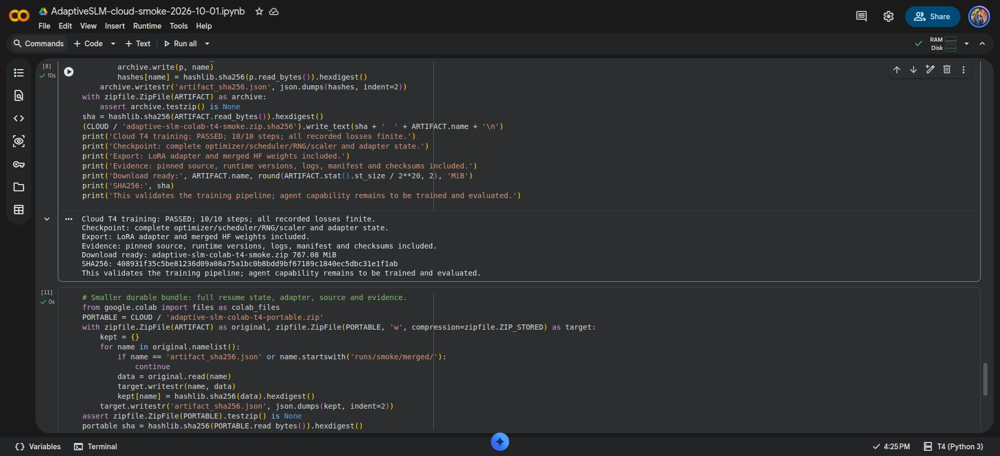

# Free Colab T4 execution record

On 2026-10-01 the browser-managed notebook cloned the user's pushed `main` commit `a72de2b4d41a7bf190b5a51d58eb7f46399b6843`, verified training-file hashes and completed a ten-step SmolLM2-360M LoRA pipeline test. The notebook is [available on Colab](https://colab.research.google.com/drive/1yjfJnJ950HbvU5lOJwM9z2jKZnW1yK7o); its source is copied to `training/colab_managed_smoke.ipynb`.

| Check | Observed result |
| --- | --- |
| Runtime | Free T4; image 2026.07; Python 3.12.13; Torch 2.11.0+cu128; CUDA 12.8 |
| Regressions | 9 passed after fixing the incompatible preinstalled TorchAO package |
| Model/data | Immutable SmolLM2-360M-Instruct and smol-smoltalk revisions in the manifest |
| Samples | 2,000 read; 623 train; 64 validation; 1,313 overlength skipped |
| Training | 10 optimizer steps; rank 8; batch 1; accumulation 2; max length 512; FP16 |
| Numerical checks | All recorded loss, eval-loss and gradient-norm values finite |
| Eval loss | 0.7863537073135376 |
| Peak CUDA allocated/reserved | 1,144,997,888 / 1,962,934,272 bytes (1.07 / 1.83 GiB) |
| End-to-end training subprocess | 76.73 seconds including imports, model loading, evaluation and export |
| Export | LoRA adapter, merged HF weights, complete step-10 checkpoint |
| Durable transfer | 804,337,993-byte archive; CRC and every member SHA256 verified locally |
| Checkpoint | Optimizer, scheduler, RNG, scaler, Trainer state, adapter weights/config and manifest verified |
| CUDA resume | Copied step-5 checkpoint and manifest into a new directory; resumed to step 10 on the same T4 runtime; every final adapter tensor exactly matched the uninterrupted run |

The bundle and extracted files are in the ignored `artifacts/cloud-runs/2026-10-01-colab-t4/` directory. Machine-readable evidence is in [colab-t4-validation-2026-10-01.json](colab-t4-validation-2026-10-01.json), with the later same-runtime recovery check in [colab-t4-resume-validation-2026-10-01.json](colab-t4-resume-validation-2026-10-01.json). The full bundle hash is `408931f35c5be81236d09a08a75a1bc0b8bdd9bf67189c1840ec5dbc31e1f1ab`. The downloaded bundle predates the recovery check; that check's source and result are saved separately in the repository.

Two cloud compatibility issues were resolved before training: PEFT 0.21 rejected the image's TorchAO 0.10, so the tested Torch 2.11 recipe pins TorchAO 0.17; and PyTorch's default BF16 probe included emulation on the T4, so training requires native support and uses FP16. The old failure log and runtime patch provenance remain in the downloaded bundle. Optional TorchAO kernels for other GPU architectures emitted warnings; ordinary LoRA completed successfully.

This run validates installation, public source/data availability, CUDA execution, checkpoint packaging and export. It does not validate an autonomous Android agent, generalization, cross-session CUDA resume, Kaggle execution, longer experiments or the performance of these newly trained weights on the phone. The earlier phone smoke measurement used a separate CPU-trained artifact. The dataset was used in the base model's original post-training, so this validation loss cannot establish a novel capability.

Automatic snapshots in the managed notebook remain on ephemeral cloud disk until downloaded. The full downloaded archive preserves the final checkpoint; it does not make every earlier snapshot durable. Native browser Save dialogs may require a manual destination selection because native UI control is unavailable. No paid runtime, Drive mount, credentials or automated account rotation were used.

After the user approved cleanup, Colab’s **Disconnect and delete runtime** action completed; the UI showed **Reconnect T4 / Click to connect**. Temporary cloud state was removed after the original archive and checkpoint had been verified locally. The saved notebook and local outputs remain available.
