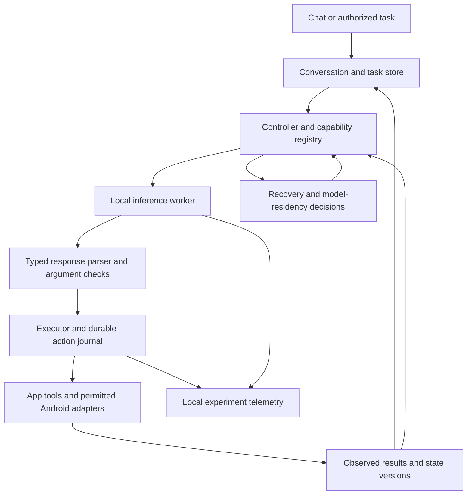

# AdaptiveSLM: next work and complete execution plan

Updated: **2026-10-01, Asia/Calcutta (IST)**. Purpose: a durable handoff and working reference for subsequent research and implementation sessions. Update this file as decisions change and milestones acquire evidence. A planned task is not a completed result.

## 1. Start here next session

**Next implementation milestone: build a minimal, fully local Android assistant and its tool/evaluation harness, using fixed model weights.** Establish real phone behavior before spending free GPU time on a larger training run.

1. Read this file, the research proposal and the latest cloud execution records linked below.
2. Inspect `git status` and the current commit. Preserve the user's changes. The last verified training source is `a72de2b4d41a7bf190b5a51d58eb7f46399b6843`; newer documentation and workflow files are currently local changes.
3. Inventory the available Android SDK/NDK, JDK and Gradle tooling. There is no complete project-owned Android app/JNI integration in the inspected tree. Do not confuse upstream llama.cpp Android examples with our application.
4. Define the initial tool contracts and test fixtures, then create the Android app with an inference interface, persistent state and a deterministic executor. Implement the tools before connecting model output to mutations.
5. Repair model-specific prompt/tool formatting in the native integration, import a known-provenance model and demonstrate offline chat plus bounded tool execution on the M35.
6. Measure the app and run the small recovery pilot. Select a model/runtime and research direction from those results. Major task training follows that decision.

This planning request creates the reference file; it does not execute the implementation milestones or publish anything. When work resumes, revalidate volatile dependencies, device availability and the current user request.

## 2. Confirmed intent and constraints

| Item | Confirmed scope |
| --- | --- |
| Product vision | A personal assistant that stays on the phone, supports chat and agentic assistance, and expands across permitted phone capabilities. |
| First language | English. |
| Platform | Stock Android with user-granted permissions; no rooted/system-privileged implementation. |
| Initial controlled tools | Notes, task list and calculator in our demo app. These are research fixtures, not the final boundary of the product. |
| First device | Samsung Galaxy M35, SM-M356B, Android 16/API 36, arm64; the saved profile identifies Samsung `s5e8835` hardware. |
| Lower hardware tier | User will identify another lower-end phone. Its RAM, SoC, Android version and ABI remain unknown. |
| Memory requirement | A measured budget appropriate to each supported phone. 512 MB is not a strict whole-app requirement. |
| Training | Free Colab/Kaggle GPU sessions with portable, durable checkpoints. No paid teacher service or paid GPU assumption. |
| Timing | No fixed deadline; prioritize a useful prototype and a credible publishable study promptly. User will choose a venue later. |
| Inference | Fully local for the demonstrated assistant. Model/data acquisition during development is separate from offline inference. |

“Any low-end phone” is the long-term ambition. Publish the measured support range, including minimum tested Android/ABI/RAM and excluded devices. Stock Android does not grant arbitrary access to other apps' private data. USB debugging is development instrumentation, not a deployable permission model.

## 3. Verified state and outstanding evidence

| Area | Verified evidence | Boundary |
| --- | --- | --- |
| Local regression checks | 9 Python regressions and 4 native CTest checks passed during the audit. | Rust tests, complete Android app and sustained device behavior remain unverified. |
| Training/export chain | A separate CPU-trained SmolLM2 smoke artifact was merged, converted and quantized, then ran through native Android inference. | This artifact is different from the later cloud-trained weights. |
| Phone smoke | Three short generations: about 15.9 generated tokens/s including prompt processing; 385.5 MiB peak native-process RSS; context allocation 2048; 4 threads. | USB powered, short workload, legacy prompt wrapper. Not decode-only speed, whole-app memory, energy, agent quality or sustained performance. |
| Free cloud training | Colab image 2026.07, Python 3.12.13, Torch 2.11.0+cu128, CUDA 12.8, free T4; 9 tests passed; 10 optimizer steps completed with finite recorded losses. | Kaggle and a new provider-session restore have not been exercised. |
| Cloud memory | Peak CUDA allocation 1,144,997,888 bytes; peak reserved 1,962,934,272 bytes in the initial smoke. | Approximately 1.07/1.83 GiB. Not a prediction for another model, context or batch size. |
| Cloud evaluation | Loss 0.7863537073; 2,000 sampled records yielded 623 train and 64 validation records; 1,313 overlength records were skipped at 512 tokens. | Generic smol-smoltalk was used in the base model's post-training. This is pipeline evidence, not independent generalization or agent accuracy. |
| Recovery check | Copied the step-5 checkpoint into a new run directory, resumed on the same T4 runtime to step 10; final adapter tensors matched exactly, max difference 0. | Does not establish bitwise identity across sessions, GPU types or package changes. |
| Durable outputs | Full archive, adapter, merged HF weights and full step-10 checkpoint were downloaded; CRC and member SHA256 checks passed. | The original archive predates the later GPU recovery check; its source/result are separately saved in the repo. |
| Cloud cleanup | User approved runtime deletion; Colab showed “Reconnect T4 / Click to connect.” | Temporary cloud files are gone. Do not reconnect expecting those files to exist. |

### Evidence and artifacts to preserve

- [Research direction and closest-work matrix](/home/anubhav/Anubhav/Adaptive-SLM/docs/research/research-direction.md).
- [Original audit](/home/anubhav/Anubhav/Adaptive-SLM/docs/research/2026-10-01-audit-and-plan.md) and [audit validation](/home/anubhav/Anubhav/Adaptive-SLM/docs/research/audit-validation.json). Their earlier “cloud CUDA unverified” statements are historical; the newer records below supersede that status.
- [Literature reading-depth log](/home/anubhav/Anubhav/Adaptive-SLM/docs/research/literature-review-log.md).
- [Phone profile](/home/anubhav/Anubhav/Adaptive-SLM/docs/research/phone-profile.json) and [native smoke output](/home/anubhav/Anubhav/Adaptive-SLM/docs/research/phone-native-smoke.txt). Available RAM is a dated snapshot, not a reserved app budget.
- [Cloud run report](/home/anubhav/Anubhav/Adaptive-SLM/docs/research/colab-t4-run-2026-10-01.md), [cloud validation](/home/anubhav/Anubhav/Adaptive-SLM/docs/research/colab-t4-validation-2026-10-01.json), and [GPU resume validation](/home/anubhav/Anubhav/Adaptive-SLM/docs/research/colab-t4-resume-validation-2026-10-01.json).
- [Browser-managed workflow source](/home/anubhav/Anubhav/Adaptive-SLM/training/colab_managed_smoke.ipynb), [portable notebook](/home/anubhav/Anubhav/Adaptive-SLM/training/mobile_baseline.ipynb), and [training guide](/home/anubhav/Anubhav/Adaptive-SLM/docs/training.md).
- Local, Git-ignored output directory: `/home/anubhav/Anubhav/Adaptive-SLM/artifacts/cloud-runs/2026-10-01-colab-t4/`. It contains `checkpoint-transfer.zip`, the original full archive, `runs/smoke/adapter/`, and `runs/smoke/merged/`.
- Original full archive: 804,337,993 bytes; SHA256 `408931f35c5be81236d09a08a75a1bc0b8bdd9bf67189c1840ec5dbc31e1f1ab`.
- Rebuilt starter: [archive](/home/anubhav/Anubhav/Adaptive-SLM/artifacts/adaptive-slm-mobile-starter.zip); SHA256 `8e59ae474ae1941a011ec242e652fe6aa0e1149d85a043dbd2faf7d1ca9cfc96`. Rebuild and record a new hash after changing starter files.
- The earlier audit left its own temporary phone directory `/data/local/tmp/adaptive-slm-audit-20261001` pending cleanup because ADB disconnected. Reconnect, inspect that exact directory and handle cleanup within the applicable authorization; do not remove unrelated phone files.

## 4. Product architecture to implement

Use **Kotlin + a simple Compose UI**, **Room/SQLite** for application/task state, and a **single-owner local inference worker** behind a runtime interface. Reuse the existing C++ code where it is useful. A separate Rust mobile integration is not on the initial critical path; its web-search path must not become an inference dependency. Check the current [Compose](https://developer.android.com/compose) and [Room](https://developer.android.com/training/data-storage/room) setup guidance when choosing the locked build versions; do not assume older coordinates/compiler plugins still apply.

### Runtime integration

- Introduce `InferenceEngine` operations for load, formatted conversation generation, token streaming, cancel, release and metrics. One worker owns each native context; serialize access rather than assuming the C++ context is safe for concurrent calls.
- Replace the hardcoded profile/ChatML construction in `core/src/inference.cpp` with an explicit model-specific template path. Preserve system/user/assistant/tool roles and tool identifiers. Check tokenizer/chat-template parity against the pinned HF source on several fixtures, not just one prompt.
- Provide complete tool-result conversations and explicit terminal states. A successful model response does not establish that an action executed.
- Verify UTF-8 streaming, special-token termination, output limits, prompt admission, cancellation during prefill/decode, background/foreground transitions and release/reload. Test failure cleanup and JNI handle lifetimes.
- Measure actual memory reclamation after releasing KV/model allocations. The existing ACC effective context limit is not evidence that allocated KV memory shrinks.
- Import models through a user-selected file with an artifact manifest/checksum. Keep model acquisition separate from ordinary assistant use. Verify offline operation with network unavailable; the research flavor can omit `INTERNET` permission if its selected runtime permits it.
- Keep idle activation light. An optional assistant role/voice service comes later; Android recommends putting heavy work outside the always-running `VoiceInteractionService`. [Official service documentation](https://developer.android.com/reference/android/service/voice/VoiceInteractionService).

### Tool contracts and execution

Start with versioned contracts for `calculator.evaluate`, `notes.create/search/read/update`, and `tasks.create/list/complete`. Use stable entity IDs, explicit argument types and deterministic fixture data. Additional tools are introduced only with an observable success/failure contract.

Each action/result should carry task ID, action/operation ID, plan version, arguments, relevant entity versions, capability/permission requirements, status, error category and verification evidence. Persist the proposed action before dispatch; record observed completion before admitting dependent actions.

For our own app, put mutations, deduplication by operation ID and durable outcome records in the same database transaction where possible. Repeating an operation ID must return the existing result. Use version checks to reject stale writes atomically. For third-party integrations without those guarantees, retain `outcome_unknown` and reconcile or ask the user rather than blindly retrying a mutation. Do not claim exactly-once effects across arbitrary apps.

Use schema-constrained output where the runtime supports it, followed by independent tool-name/type/value validation. Function-call syntax is data; never execute generated Python, shell or arbitrary code. Tool text and retrieved content cannot expand the user's task authority. The calculator needs a bounded parser, numeric/domain checks and deterministic arithmetic rather than `eval` or model arithmetic.

The loop needs finite step/token/time budgets, bounded retries, a cancel state and a visible action history. After cancellation, admit no new tool actions. Missing intent, unavailable capability and denied permission are explicit outcomes; do not report completion. Confirmation rules should be tied to concrete action categories and user-granted scopes so routine, authorized tasks do not repeatedly prompt.

### First recovery controller to implement

1. Reload the persisted task, authority, action journal and current process/model-residency state. A canceled or expired task must not silently resume.
2. Reconcile pending effects through operation IDs and fresh observations. An outcome that cannot be established remains uncertain; retry only when the tool contract makes repetition safe.
3. Validate the inputs and permissions required by the next action. If an entity/version changes, invalidate the dependent remaining plan rather than discarding all unrelated verified progress or trusting a stale reasoning summary.
4. Form eligible candidates: verified continuation without inference; context reconstruction and local replanning; deferral; or clarification. Eligibility depends on correctness evidence and authority before resource cost is considered.
5. Compare measured verification/execution cost with model load, prefill and decode cost, including whether the model is already resident. Begin with calibrated rules and a simple cost table; do not use unmeasured battery or thermal estimates as precise energy.
6. Persist the chosen mode, evidence, estimated costs and plan version; execute one bounded action; observe its outcome; repeat. Reconstruct model context from relevant valid state and compact records when needed.

Research telemetry and training fixtures should use synthetic data or specifically consented data. Do not automatically upload private phone contents into cloud training. Keep proposed reasoning separate from authoritative tool outcomes and disclose uncertain external effects to the user.

## 5. Model and runtime decision plan

**Keep SmolLM2 as a reproducible pipeline baseline; do not assume it is the final model because it trained successfully.** Benchmark untouched candidates before adapting them.

| Candidate | Intended comparison | Required gate |
| --- | --- | --- |
| SmolLM2-360M-Instruct | Existing reference for training/export and integration checks. | Compare original versus smoke-adapted weights; the synthetic/ten-step artifacts are not quality baselines by themselves. |
| LFM2.5-350M | Compact general chat and tool-use candidate. | Pin weights/template/runtime; check custom license and actual tool-result protocol. Author documentation supports structured/tool use but cautions about knowledge-heavy tasks and programming. [Official model card](https://huggingface.co/LiquidAI/LFM2.5-350M). |
| FunctionGemma 270M | Tool-specialist baseline; potentially a separate small action model. | User handles gated terms/access where required. Use its native call template and a separate training/export path. It is not a general-chat replacement. Existing local phone-action adaptation is prior art. [Official Mobile Actions recipe](https://ai.google.dev/gemma/docs/mobile-actions). |
| Qwen3-0.6B | Transformer chat/tool alternative if the phone budget permits. | Explicitly configure and test non-thinking mode; pin template and output budget. [Official model card](https://huggingface.co/Qwen/Qwen3-0.6B). |
| Qwen3.5-0.8B | Optional larger comparison. | Add only if smaller candidates miss required quality and measured memory/export support permits it; not an initial training commitment. |

Start with a modern, immutable **llama.cpp CPU** runtime because the repo and artifacts already use it. Preserve the tested **b5260** SmolLM2 compatibility path separately. Do not replace its pin and converter globally before modern-model tests pass. Android guidance includes portable arm64 NDK builds; the previous phone binary's `armv8.2-a+dotprod` target is not a universal low-end-device baseline. [Official Android guide](https://github.com/ggml-org/llama.cpp/blob/master/docs/android.md).

Compare **one accelerated alternative**, initially LiteRT-LM if its selected model/backend is supported on the M35. Its Android Kotlin API provides CPU/GPU/NPU options and tool integration, but actual SoC/model support must pass a device test. [Official Android API](https://developers.google.com/edge/litert-lm/android). ExecuTorch is a contingency if the chosen model/export path favors it; MLC/MNN remain further options rather than simultaneous implementations.

Separate runtime comparisons with the same model where possible from model comparisons. If a runtime only supports another model, report that confound. Do not adopt GPU/NPU acceleration, speculative decoding or a second resident model based solely on vendor numbers.

A single general model is the first integration target. Add a chat/tool model pair only if quality gains outweigh storage, cold-load, idle memory and routing costs. Initially keep at most one large model resident. Measure the combined system if two are ever loaded together.

## 6. Milestones, deliverables and completion gates

No calendar deadline is assumed. The order below is the dependency order; independent literature review and test design can continue while builds/downloads run.

### M0 — Preserve the baseline and make experiments reproducible

- [x] Audit the repository and inspect the authorized phone.
- [x] Complete CPU export/native-phone pipeline smoke and free T4 training smoke.
- [x] Verify durable model/checkpoint transfer and same-runtime CUDA recovery.
- [x] Release the free GPU after user-approved cleanup.
- [ ] Record all experiment artifacts in an index: source commit, model/data revisions, template, quantization, runtime, device, seeds, commands and hashes. Keep earlier reports historical.
- [ ] Review current local changes and make a coherent reproducibility commit when authorized; do not push model binaries or credentials into Git.
- [ ] Before a longer run, test checkpoint restore in a **new provider session** and then Kaggle with the compatible environment. Preserve logs and reject corrupted/incompatible restores.

**Gate:** another session can reproduce the smoke from the pinned source and restore an interrupted planned run without lost optimizer/scheduler/RNG/scaler state.

### M1 — Define the evaluation contract and build the Android shell

- [ ] Create a small task catalog with initial state, request, expected observable final state, allowable effects, dependencies, authority and failure outcomes.
- [ ] Implement the three controlled tool families and their state validators. Test create/update/complete, duplicate operation IDs, stale versions, missing entities, calculator errors and cancellation without an LLM.
- [ ] Create `android-app/` with Kotlin UI, conversation/task storage, model import, inference-worker interface, streaming and cancel controls. Pin dependencies/toolchain versions after a clean build.
- [ ] Use a mock planner first so executor and recovery behavior can be tested independently of model quality.
- [ ] Integrate native inference and model templates; add valid-call, malformed-call, no-tool and clarification fixtures.
- [ ] Build/install on the authorized device and demonstrate airplane-mode chat and task execution against synthetic app data.

**Gate:** an APK runs offline on the M35; tool outcomes are verified from app state; cancellation/restart behave correctly; model operations do not block the UI. No claim of broad cross-app control yet.

### M2 — Measure untouched model/runtime baselines and select a candidate

- [ ] Use the same English task/negative/clarification suite across viable models; distinguish each native protocol from the canonical internal action representation.
- [ ] Compare cold/warm model load, time to first token, prefill, decode, total task latency, calls/tokens, syntax/argument correctness and observed task completion.
- [ ] Sweep a small set of thread/context settings, starting from the known 4-thread/2048-context configuration and smaller contexts where task admission permits. Keep settings in manifests.
- [ ] Measure whole-app and all worker-process PSS/RSS, peak load memory, steady memory, storage and reclamation. Do not sum shared RSS as if it were unique memory.
- [ ] Run repeated work for 15–30 minutes under recorded charging/screen/temperature conditions, then inspect slowdown, OOM, crashes and background behavior.
- [ ] Compare one supported acceleration path and freeze the model/runtime/quantization for controller experiments.

**Gate:** choose the smallest viable candidate from quality/latency/memory evidence. Set the M35 budget and provisional UX targets from measured results. Revisit minimum API/ABI when the lower-end phone is known.

### M3 — Test the research hypothesis with fixed weights

- [ ] Implement a persistent journal and a fixed recovery baseline before adaptive policy work.
- [ ] Add controlled interruption hooks: before dispatch, after effect commit but before acknowledgement, between dependent actions, after model release and during inference. Inject into our test app only.
- [ ] Model task/effect uncertainty explicitly; validate relevant dependencies and authority on restart. Separate model unload, worker death, whole-app restart and OS lifecycle conditions.
- [ ] Begin with a small proposed pilot: 8 distinct workflows × 4 conditions × 3 controllers × 2 repeats = 192 episodes. Include clean execution, process restart, model-unloaded restart and a changed-state/lost-acknowledgement condition. Expand only after recording actual episode costs.
- [ ] Compare fresh replanning, journal + fixed recovery, and lifecycle/residency-aware selection; include a deterministic workflow engine as a diagnostic reference.
- [ ] Estimate verification, load, prefill, decode and execution costs from measured traces. Start with an inspectable rules/cost policy selecting eligible continuation, local replanning, deferral or clarification.
- [ ] Finish citation tracing and reproduce/adapt the strongest relevant prior methods before claiming an additional mechanism.

**Gate:** identify a reproducible weakness of strong existing approaches and show that explicit lifecycle/residency inputs help at comparable verified completion. If a deterministic engine or the prior-method combination solves the suite cheaply, expand the language/composition challenges or revise the research question before training.

### M4 — Create task data and fine-tune only after the pilot

- [ ] Freeze independent held-out task compositions, argument patterns, entity states and perturbation schedules before generating training paraphrases.
- [ ] Build a versioned synthetic/local task dataset from executable fixtures and actual baseline failures. Proposed starting scale: a few thousand examples, revised from coverage and free GPU cost.
- [ ] Include correct calls, no-tool requests, missing information, denied/unsupported capabilities, tool errors, state changes, uncertain effects, cancellations, recovery and final result-grounded responses. Balance coverage by contract/failure type.
- [ ] Implement complete multi-turn tool-role/call/result serialization, assistant loss masks and the selected model's native protocol. The current starter accepts string system/user/assistant records and does **not** implement native tool-role training.
- [ ] Audit token lengths and role masks. Do not discard most recovery examples under an arbitrary 512-token limit or truncate away their decisive tool result; choose context/data boundaries from the measured budget.
- [ ] Train one selected LoRA baseline, with a new experiment directory, immutable revisions, planned total steps and validation schedule. Keep an untouched model comparator and controller settings fixed for attribution.
- [ ] Save full checkpoints regularly and persist them outside ephemeral disk; restore before doing more training in another session.
- [ ] Merge/export/quantize with a validated model-specific path, verify template parity, and score both reference and deployed quantized artifacts on the frozen tasks.

**Gate:** adaptation improves held-out task behavior without unacceptable chat/recovery regressions. The exact deployed artifact passes the app/device tests. Do not infer success from decreasing training loss.

### M5 — Expand permitted phone capabilities and product behavior

- [ ] Ask the user to prioritize two real cross-app workflows beyond the controlled fixtures and define their allowed effects before implementing them.
- [ ] Prefer app-exposed APIs, Intents and user-selected documents. Distinguish launching a composer/settings screen from successfully completing its action.
- [ ] Add capability discovery, per-action permission checks, unavailable-feature handling and verified outcomes where the target API exposes them.
- [ ] Investigate AppFunctions as an optional Android 16+ adapter. It is currently experimental, callers require `EXECUTE_APP_FUNCTIONS`, and full pipeline access is limited; prove actual access rather than making it a portability dependency. [Official overview](https://developer.android.com/ai/appfunctions).
- [ ] Treat accessibility/GUI control as a separately enabled research path in controlled apps. Plan distribution separately: Play policy prohibits general autonomous initiation/planning/execution through AccessibilityService, with a specific qualifying accessibility-tool exception. Do not presume the exception applies. [Official policy](https://support.google.com/googleplay/android-developer/answer/10964491?hl=en).
- [ ] Add optional user-chosen assistant activation, lightweight triggers and local retrieval/memory. Task authority must remain explicit when automation resumes later.
- [ ] Add offline voice or vision only after a demonstrated use case and separate memory/latency/idle-power evaluation. Avoid always-resident speech/vision models in the initial low-memory baseline.

**Gate:** selected stock-Android workflows work within documented permissions; unverifiable effects remain explicit. Unsupported apps/phones degrade predictably. The product roadmap remains broader than the first controlled demo.

### M6 — Run the final study and prepare publication artifacts

- [ ] Freeze hypotheses, task families, exclusions, support tiers, policy thresholds, statistical procedure and experiment manifests before held-out scoring.
- [ ] Add the second lower-end phone; a third device would strengthen portability evidence. Single-device results must be labeled as such.
- [ ] Run matched baselines, fault conditions and ablations on the exact quantized mobile artifact. Report successes, incorrect/duplicate effects, uncertainty, deferrals and clarification separately.
- [ ] Release the permitted task generator, schemas, fault injector, evaluation code, raw/redacted traces, device/runtime profiles, dataset split hashes and training manifests. Check all upstream/data/model redistribution terms first.
- [ ] Draft a paper around the measured contribution, comparisons, limitations and failure cases. The user selects a venue; do not promise acceptance or claim an unexplored field from search-result absence.

**Gate:** results are reproducible, prior comparisons are substantive, claims match the evidence and the package can be independently evaluated. A negative pilot may justify a careful empirical study or a pivot rather than a novel-method claim.

## 7. Research direction, hypotheses and required comparisons

Working question: **Can a sub-billion local Android assistant recover after process death or model unloading while preserving verified progress under mutable user state, at lower inference/recovery cost?**

The candidate contribution is an execution/recovery decision method that explicitly models **Android lifecycle and model residency**, plus real-device evaluation. This remains provisional. Database journaling, idempotency, prompt compression, budget-aware replanning and local tool calling already have prior art.

| Closest work | How to use it |
| --- | --- |
| [ADF-EA](https://arxiv.org/html/2609.30691v1) | Persistent evidence/authorization is a required comparison, not our invented foundation. Review guarantees and released implementation. |
| [BRACE](https://nebulis-lab.com/BRACE/) | Compare budgeted replanning and its combination with execution assurance. Acquire/review the full paper; the earlier review used the authors' project page. |
| [PlanFence / Fresh Memory, Stale Plans](https://arxiv.org/html/2609.03340v2) | Dependency-scoped plan validation comparator; respect its assumptions and the external execution atomicity boundary. |
| [AndroidReality](https://arxiv.org/html/2608.07775v1) | Relevant perturbation/recovery methodology; distinguish its setup from phone-local inference. |
| FunctionGemma Mobile Actions | Mandatory acknowledgement of existing local phone-tool adaptation; tool coverage alone is not novelty. |
| Structured context management, MobileExplorer, AndroidWorld, plan caching and mobile memory studies | Complete full reading/artifact review as listed in the existing literature log; use relevant strong comparisons rather than relying on titles/abstracts. |

For each source record version, publication status, released code/license, inference location, devices, interruption model, state/authority guarantees, baselines and limitations. Clearly distinguish original implementations from our adapted approximations. Trace backward/forward citations and refresh the search immediately before submission.

Proposed hypotheses: residency-aware recovery reduces cold inference/context work; dependency validation prevents stale continuation; the benefit persists on a lower-end device and after quantization. Test each separately. Hold model weights fixed when measuring controller effects.

Final comparator set should include fresh replanning; durable journal + fixed recovery; dependency validation; execution-assurance and cost-control methods separately and combined; compact context reconstruction without residency-aware selection; and the proposed controller. Include a deterministic engine. Use the same authority and correctness checks across eligible controllers so gains do not come from giving the proposed system extra permissions or stronger tool contracts.

## 8. Evaluation contract and measurement procedure

### Tasks and faults

Use machine-checkable final state and effect history. Proposed final coverage is 40–60 distinct multi-step workflows, adjusted from the pilot before freezing the test suite. Hold out compositions and argument/state patterns, not only paraphrases of seen templates.

Cover clean runs; model release/cold load; app/worker death; lost acknowledgement; user edits/completion between steps; tool errors; denied/revoked permissions; unavailable capabilities; delayed/ambiguous outcomes; and supported resource-pressure conditions. Include malicious instructions inside synthetic note/tool text, numeric/negation conflicts and cancellation races.

Record exact fault points and initial state. A model unload, deliberate process kill, force-stop, `onTrimMemory` signal and observed OS low-memory kill are different conditions. Do not label an injected force-stop as an observed OS low-memory eviction. Use emulator/test-device conditions for disruptive pressure tests rather than affecting unrelated personal apps.

### Metrics

Report verified completion; wrong/duplicate effects; contract/argument correctness; unsupported/clarification handling; uncertainty/defer rates; recovery p50/p95; total task latency; model invocations; prompt/generated tokens; load/prefill/decode breakdown; peak/full-app memory; idle residency; storage; crash/OOM counts; and sustained thermal/throughput behavior. Measure energy per successful task only with suitable instrumentation; do not treat short battery-percentage changes as precise energy.

Use monotonic clocks for durations, stable episode/task IDs and logs with state hashes. Record model/runtime/source revisions, template, quantization, context, threads/backend, seed, device/build, charging state, brightness and temperature conditions. Use paired task/fault seeds and randomized or counterbalanced run order. Reset fixtures between episodes and prevent one method's warm cache/state from benefiting another unintentionally.

Choose repetitions and final sample size from pilot variability and cost, before held-out evaluation. Report confidence intervals; cluster by workflow when variants share a template. Zero observed incorrect effects is a finite-sample finding, not a universal guarantee. Count unresolved and deferred episodes in the denominators specified by the protocol; refusing every task is not success.

### Proposed engineering and research gates

- Initial simple-suite goals: at least 99% valid constrained output, at least 90% verified clean-task completion, zero observed unintended effects, and no crash/OOM in the agreed sustained test. These are proposed targets, not achieved results.
- Set memory, time-to-first-token, p95 task latency, cancellation and idle-power budgets per device from M2 measurements, then freeze them before final scoring.
- Suggested pilot signal: at least 15% median recovery-cost reduction against the strongest relevant baseline, with comparable completion and no observed increase in duplicate/incorrect effects. This is a screening proposal; predeclare a final non-inferiority margin and statistical procedure after the pilot, before touching the final test set.
- Ablate persistent evidence, dependency checking, context reconstruction, resource inputs, residency/lifecycle inputs and adaptive selection. Add learned selection only if it beats the transparent rules policy on held-out tasks/devices.
- Keep energy, speed, memory and correctness claims separate. A lower token count obtained by dropping necessary context is not an improvement in successful task throughput.

## 9. Free-session training and checkpoint runbook

1. Use the tested Colab **2026.07** image / Python 3.12 / T4 combination as the starting environment. Recheck compatibility on any new image/provider. Keep the provider's CUDA Torch wheel.
2. The tested dependency pin is TorchAO **0.17** with Torch **2.11** and the mobile requirements. Preinstalled TorchAO 0.10 broke PEFT 0.21. T4 training uses FP16; `is_bf16_supported(including_emulation=False)` avoids selecting emulated BF16. Preserve precision in the run manifest.
3. Verify the exact source commit and model/data revisions, dataset schema/license and complete preflight. New model families need their own protocol/export tests; installing a newer trainer does not supply those automatically.
4. Use a fresh research run directory and choose its planned total steps before starting. The saved ten-step checkpoint is already complete; do not silently extend its schedule and call that the same experiment.
5. Save checkpoints at a cadence justified by measured step time and tolerable lost work. Package completed checkpoints using `bundle_checkpoint.py`; retain adapter, optimizer, scheduler, RNG, scaler where applicable, Trainer state, manifest and hashes. The helper's generic required-file list does not by itself guarantee a CUDA scaler is present; validate the FP16 checkpoint explicitly.
6. Copy/download to durable storage and verify locally. Periodic archives on cloud disk alone are still ephemeral. Native browser Save dialogs may need the user to select a destination; do not treat a download request as a completed transfer.
7. For a new session, restore a verified checkpoint into a compatible run directory before resuming. Keep model/data/tokenization/seed/batch/accumulation/learning rate/total steps/precision/package assumptions unchanged. Record any hardware difference; cross-GPU bitwise reproducibility is not promised.
8. Before a long experiment, deliberately interrupt a small **planned** run, persist an intermediate checkpoint, restore it in a fresh session and compare its outcome to an uninterrupted reference. Same-runtime recovery is already tested; fresh-session recovery is the next missing check.
9. Archive logs/evaluation/export evidence and verify durable outputs before ending the runtime. Release GPU sessions when work ends; cloud-file deletion must follow the applicable confirmation rule.
10. Keep account login and access decisions with the user. There is no account-rotation automation; respect provider eligibility/usage limits and resume when an eligible free session is available.

No on-device training, training from scratch, online-teacher loop, large-scale RL or broad architecture rewrite is on the first-paper critical path. Investigate them only after the measured baseline exposes a problem they can solve.

## 10. Proposed repository deliverables

These are planned paths, not files claimed to exist yet:

| Path | Intended responsibility |
| --- | --- |
| `android-app/` | App UI, JNI/runtime adapters, tool registry, Room stores, controller, recovery hooks and Android tests. |
| `schemas/` | Canonical tool/action/result contracts and versions shared by training/evaluation/app adapters. |
| `evaluation/` | Task generator, seeded fixtures, final-state validators, fault schedules, paired runners and metric aggregation. |
| `configs/experiments/` | Immutable experiment configuration and support-tier definitions. |
| `training/prepare_agent_data.py` | Planned multi-turn data builder/validator; separate from the current generic starter. |
| `training/finetune_agent.py` | Planned model-specific task adaptation path with full tool-role masks and resume metadata. |
| `docs/research/literature-matrix.*` | Full-reading/artifact/novelty comparisons and versions. |
| `docs/research/model-runtime-selection.md` | Device measurements and the selection decision. |
| `artifacts/` | Small reproducibility bundles; large model/run outputs remain ignored, indexed and durably backed up. |

Keep schema adapters independent of model-specific serialization. Preserve the existing numerical regressions when changing legacy code. Run meaningful tests for parsers, tool effects, recovery/uncertainty, role masks, JNI lifetimes and serialization parity; avoid tests that merely duplicate implementation text. Changes to files outside this plan's immediate implementation scope need a concrete reason.

## 11. Decisions requiring user context when their phase begins

| Decision | Why it matters | Does it block the immediate controlled app? |
| --- | --- | --- |
| Lower-end phone, Android version, RAM and ABI | Establish minimum support tier and portability evidence. | No; blocks broader low-end claims/final device study. |
| Two priority real phone workflows and target apps | Determines available APIs, effects, permissions and verifiable outcomes. | No; needed for M5. |
| Autonomy categories, triggers and confirmation preferences | Defines task authority for persistent/proactive behavior. | Controlled synthetic tasks can proceed; real autonomous workflows need this. |
| Accepting FunctionGemma terms/model access | Affects specialist reproduction and training availability. | No; public compact candidates and the executor remain available. |
| Persistent checkpoint storage beyond this workstation | Prevents loss in longer multi-session experiments. | Local durable transfer works; choose additional storage before depending on it. |
| Voice/vision priority, expected chat domain and acceptable failure handling | Changes model choice and memory/UX budgets. | No; English text-first demo is the established starting point. |
| Publication venue/artifact requirements | Determines submission format, length, review dates and release constraints. | No; user will select this later. |

Ask for context when a decision changes the dependent implementation; keep independent work moving. Do not invent a phone specification, grant broader action authority, assume a gated license has been accepted or substitute a narrower product vision for the user's goal.

## 12. Risks, pivots and work intentionally deferred

| Evidence/problem | Planned response |
| --- | --- |
| Prior work already solves the proposed lifecycle/residency problem | Pivot or present an explicitly incremental/empirical study; do not claim novelty through renaming. |
| Compact model cannot follow tool/clarification contracts reliably | Improve schema/data and test one specialist or modestly larger candidate within measured memory. Keep execution deterministic and outcome-grounded. |
| Dual models cost more than they help | Keep one model and explicit task routing; measure cold-load/residency tradeoffs before adding complexity. |
| Quantization damages action selection | Compare another quantization/size on the same test; report degradation and support tiers. |
| Memory/thermal limits fail under sustained work | Reduce admitted context/batch/thread/token budgets, unload idle models, simplify retrieval/backend; retain correctness constraints and remeasure. |
| Desired app lacks a supported tool API | Report the capability boundary; use a controlled research adapter where authorized. Do not silently substitute ADB privilege for app capability. |
| Free session interruptions or changing package images | Durable full checkpoints, pinned recipes, preflight, new-session resume checks and documented failures. |
| Data leakage or reused generic SFT benchmark | Freeze independent task families, deterministic split groups and hashes; evaluate the deployed artifact on unseen compositions. |

Legacy custom-student architecture, PAKD/profile distillation, semantic cache, early exits and speculative/vision/voice expansions remain separate experiments. The repo's older “novel contribution,” 512 MB, student quality and speed labels are not evidence. Any retained feature needs its own meaningful baseline and ablation. Do not mix changes to planner/model/controller/backend while attributing one headline improvement.

## 13. Handoff update format

At the end of each implementation session, append a short dated entry: completed items and evidence paths; exact source/model/runtime revisions; failed checks and saved logs; current device/cloud state; changed decisions; blockers that actually require user input; and the next concrete action. Update milestone checkboxes only when their gates have supporting evidence. Reconcile newer records rather than overwriting historical measurements.

**Current handoff:** training/export/checkpoint infrastructure has passed its bounded checks and the free T4 was released. The complete Android assistant, modern-model comparison, native tool-role training, lifecycle pilot and publication study remain to be built. Begin with M1's contracts and Android shell, while continuing the closest-paper review; validate a fresh-session resume before a longer task-training experiment.
